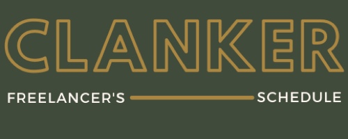

# Clankers - Milestone Project 3

Welcome to Clankers, The Freelancer's Scheduling Application

Clankers was created as my Milestone Project 3 Submission with [Code Institute](https://codeinstitute.net/). With this project, I was focusing primarily on Data-centric Development, use of the Python language, as well as incorporating HTML, CSS and Javascript where necessary.

Clankers is a webpage targeted towards freelancers of any industry, providing an environment in which the user is able organise all their upcoming appointments, both virtual and in-person, create portfolios of clients, and see their history of appointments with specific clients.

## UX

To provide users with a streamlined, efficient platform in which to organise their meetings, Clanker has four core facets:
<dl>
  <dt>Professionalism</dt>
  <dd>One adjective that must be employed throughout the website is professionalism. The site must stand out as a professional environment.</dd>
  <dd>However, the website must not be intimidating or offputting to a casual or new user.</dd>

  <dt>Easy to navigate</dt>
  <dd>A professional must be able to access any necessary info as quickly as possible.</dd>
  <dd>Navigation links must be uniform, easy to recognise (through the use of standard icons to aid accessibility).</dd>
  <dd>A user must not be overloaded with information. The interface must remain clean and uncrowded.</dd>

  <dt>Security</dt>
  <dd>Whether handling sensitive information, any data stored must be keep secure.</dd>

  <dt>Current Data</dt>
  <dd>When any data is created, deleted, or updated, the presentation of that data must respond according. Any professional does not wish to be handling outdated information that can interupt their efficiency.</dd>
</dl>

Maintaining these key objectives in mind, Clankers provides two windows while operating the platform, allowing users to see the overview of their appointments, and the specific details at once. This encourages time-efficiency and readability.

Furthermore, the website must be available across all devices, so that users are able to access their schedules regardless if they are situated at a desk with a PC, or on the go with a handheld device.

### User Stories

* As an online tutor, I want an enviroment to store and access information about all my classes, both past and future.
* As a personal trainer, I want to schedule appointments in advance to easily allocate my time amongst clients.
* As someone on the go, I want to be able to check my schedule whenever and wherever I need.
* As a professional who charges by the hour, time is key for me, so I want an application that is easy to access/navigate.
* As a freelancer web designer, I want a place to store all my clients information in one location.

### Wireframing

I created and hosted my wireframing layouts with [Moqups](https://moqups.com/ "Moqup's Homepage")
My wireframes can be found [here](https://app.moqups.com/KVCFtdk7J8/view/page/a6b221dc0)
 

# Features 

* Unique IDs
⋅⋅⋅ When registering with Clankers, each profile is given a unique ID, that is used to access their business information. This ensures that users are only able to access their data. This protects everyones security and confidentiality.

* The Welcome Message
⋅⋅⋅ Upon entering the Home Page, a user is greeted with a welcome message. This contains today's date, and their upcoming appointment. This keeps the user up to date.

* Interactive Schedule
⋅⋅⋅ While presenting the appointments scheduled for that week, the user is also able to click on a specific appointment card to see further details and/or edit any necessary details.

* In-screen secondary windows
⋅⋅⋅ To increase readability throughout the website, the user is provided with the interactive calendar, and a secondary screen that displays supporting details about your profile, clients or specific appointments. With this window, users are able to create, read, update and delete all relevant data without 'breaking' the site.

### Future Features 

* Customizable Schedule
⋅⋅⋅ Allow users to select the starting and ending times as well of the length of their schedule (e.g 06:00-14:00 or 09:00-19:00). Users will also be able to choose their preferred schedule time divisions.(15 minutes, 30 minutes or 1 hour) Finally user will be able to select the starting day of their schedule(currently set to Sunday).

* View different weeks
⋅⋅⋅ Currently user can only view the schedule of the current week. In the future, the web site will allow user to specify which week they wish to view, both future and present.

* Automatic Emails
⋅⋅⋅ Creating or updating an appointment will generate an automatic email to the client alerting them of the appointment.

* File Storage
⋅⋅⋅ Allow users to store relevant files to specific appointments or clients that can be forwarded with an automatic email or opened when required.

# Technologies used

This projected was created with Python, Javascript, CSS and HTML.
Data storage was handled by [MongoDB](https://www.mongodb.com/), and was manipulated with a number of Python Packages, which can be found in my [requirements.txt file](requirements.txt)

[Jquery](https://jquery.com/) was employed to streamline Javascript DOM manipulation throughout the project.

[Materialize](https://materializecss.com/) was used for a more elegant range of HTML components, such as DatePickers or Select options. CSS and Javascript files were used in tandem, as provided by Materialize, additionally providing icons, which were in turn provided by Google.

[Bootstrap](https://getbootstrap.com/) was used to implement the grid system and structured layout of the entire webpage, as well as lending to the size/device responsiveness.

Fonts were resourced from [Google fonts](https://fonts.google.com/) and [Windows Fonts](https://www.wfonts.com/)

Logo was created using the [Canva](https://www.canva.com/) tool. 

Wireframing was created using [Moqups](https://moqups.com/).

Finally, there are two individual snippets of code that I resourced from external sources. These were both used in 'create-account.js' as a method to check the validation of my create account form.

These are: the form validator code, gotten from: <https://www.w3resource.com/javascript/form/email-validation.php>.

Secondly: the code to check if a string contains a number, gotten from: https://www.reddit.com/r/javascript/comments/2hhq1n/how_can_i_check_if_a_string_contains_a_number/

# Testing

All code was run through appropriate validators for testing. This includes:
* [Extends Class](https://extendsclass.com/python-tester.html)
* [JSHint](https://jshint.com/)
* [W3C CSS Validator](https://jigsaw.w3.org/css-validator/)
* [W3C HTML Vaidator](https://validator.w3.org/nu/)

Furthermore, the web page was run through a series of manual testing, which included purposeful attempts to break the code, attempting every action offered, and clicking every link.
Secondly, the web page underwent real world testing in two forms:
* I provided access to two individual acquantices of mine, both are freelancing professionals, and allowed them to experiment with the webpage. I took their reviews back to the design/production stage and attempted to address their comments and opinions to the best of my abilities.
* Upon hosting this web page, I allowed my web page to undergo reviews from my peers through [Slack](https://slack.com/intl/en-gb/) channels associated with [Code Institute](https://codeinstitute.net/)

# Deployment 

This webpage has been hosted on [Heroku](https://appointment-planner.herokuapp.com/)
I set my Config Vars to:
* IP : 0.0.0.0
* PORT: 5000
* MONGO_URI, and MONGO_DBNAME

My repository can be found on [GitHub](https://github.com/Lindsaykerr1994/Milestone-3-Appointment-Planner)
As mentioned in my Technologies section, I used a number of Python Packages, all of which can be found in the requirements.txt, created with the command "pip3 freeze --local > requirements.txt" in the CLI.
Secondly, I created a Procfile to declare a process type through the command "echo web: python run.py > Procfile"

If you wish to clone this respository:
* Follow the respository link above to the GitHub Dashboard, and click "Clone or Download.
* Use the "Clipboard Icon" to copy the URL and paste in the directory of your chosen Integrated Development Environment.

# Credits

I wanted to thank anyone who supported me during this project:
My brother and my mentor, both for their sage advice.
My friends for participating in manual tests of the web page.
To CodeInstitute for their lessons and material in preparing me.
And most noticably, my girlfriend, who I almost drove insane with my moaning about broken code.

